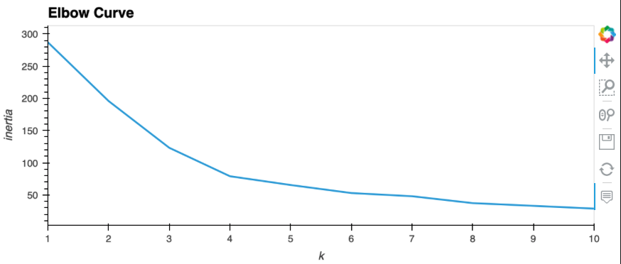

# Module_10_Challenge
## Crypto Clustering

## Background

In this challenge, I have had to assume the role of an advisor in one of the top five financial advisory firms in the world.  Instead of basing my proposal on only returns and volatility, we wanted to include other factors that might impact the crypto market—leading to better performance for your portfolio.

## What I have Created
I have combined financial Python programming skills with the new unsupervised learning skills that I have acquired in this module.

Attached is a Jupyter notebook that clusters cryptocurrencies by their performance in different time periods. I have then plotted the results to visually show the performance.Attached also is the CSV file that contains the price change data of cryptocurrencies in different periods.

What I have done is;
- Imported the data

- Prepared the data

- Found the best value for k by using the original data

- Clustered the cryptocurrencies with K-means by using the original data

- Optimised the clusters with principal component analysis

- Found the best value for k by using the PCA data

- Clustered the cryptocurrencies with K-means by using the PCA data

- Visualised and compared the results

# Results of the Analysis;

### Import required libraries and dependencies
import pandas as pd
import hvplot.pandas
from pathlib import Path
from sklearn.cluster import KMeans
from sklearn.decomposition import PCA
from sklearn.preprocessing import StandardScaler

### Load the data into a Pandas DataFrame
df_market_data = pd.read_csv(
    Path("Resources/crypto_market_data.csv"),
    index_col="coin_id")
​
### Display sample data
df_market_data.head(10)

### Generate summary statistics
df_market_data.describe()

### Plot your data to see what's in your DataFrame
df_market_data.hvplot.line(
    width=800,
    height=400,
    rot=90
)

## Prepare the Data

This section prepares the data before running the K-Means algorithm. 

### Use the `StandardScaler()` module from scikit-learn to normalize the data from the CSV file
scaled_data = StandardScaler().fit_transform(df_market_data)

### Create a DataFrame with the scaled data
df_market_data_scaled = pd.DataFrame(
    scaled_data,
    columns=df_market_data.columns
)
​
### Copy the crypto names from the original data
df_market_data_scaled["coin_id"] = df_market_data.index
​
### Set the coinid column as index
df_market_data_scaled = df_market_data_scaled.set_index("coin_id")
​
### Display sample data
df_market_data_scaled.head()

## Find the Best Value for k Using the Original Data

### Create a list with the number of k-values to try
### Use a range from 1 to 11
k = list(range (1, 11))

### Create an empy list to store the inertia values
inertia = []

### Create a for loop to compute the inertia with each possible value of k
### Inside the loop:
### 1. Create a KMeans model using the loop counter for the n_clusters
### 2. Fit the model to the data using `df_market_data_scaled`
### 3. Append the model.inertia_ to the inertia list
for i in k:
    k_model = KMeans(n_clusters=i, random_state = 1)
    k_model.fit(df_market_data_scaled)
    inertia.append(k_model.inertia_)

### Create a dictionary with the data to plot the Elbow curve
elbow_data = {"k":k, "inertia":inertia}
​
### Create a DataFrame with the data to plot the Elbow curve
df_elbow =pd.DataFrame(elbow_data)

df_elbow.head()

### Plot a line chart with all the inertia values computed with 
### the different values of k to visually identify the optimal value for k.
df_elbow.hvplot.line(
    x="k", 
    y="inertia", 
    title="Elbow Curve", 
    xticks=k
)

Question: What is the best value for k?

Answer: # The best possible 'k' value appears to be 4, demonstrated by the larger, more obvisous elbow in the above graph.
## Cluster Cryptocurrencies with K-means Using the Original Data

### Initialize the K-Means model using the best value for k
model = KMeans(n_clusters=4)

### Fit the K-Means model using the scaled data
model.fit(df_market_data_scaled)

KMeans(n_clusters=4)

### Predict the clusters to group the cryptocurrencies using the scaled data
crypto_clusters = model.predict(df_market_data_scaled)
​
###View the resulting array of cluster values.
print(crypto_clusters)
[2 2 0 0 2 2 2 2 2 0 0 0 0 2 0 2 0 0 2 0 0 2 0 0 0 0 0 0 2 0 0 0 1 2 0 0 3
 0 0 0 0]

###Create a copy of the DataFrame
market_data_scaled_predictions = df_market_data_scaled.copy()

### Add a new column to the DataFrame with the predicted clusters
market_data_scaled_predictions['CryptoCluster'] = crypto_clusters
​
### Display sample data
market_data_scaled_predictions.head()

### Create a scatter plot using hvPlot by setting 
### `x="price_change_percentage_24h"` and `y="price_change_percentage_7d"`. 
### Color the graph points with the labels found using K-Means and 
### add the crypto name in the `hover_cols` parameter to identify 
### the cryptocurrency represented by each data point.
​
​
market_data_scaled_predictions.hvplot.scatter(
    x=  "price_change_percentage_24h",
    y=  "price_change_percentage_7d",
    by= "CryptoCluster",
    hover_cols=['coin_id'],
    title = 'Interactive Coin ID by change percentage over time'
)

## Optimize Clusters with Principal Component Analysis

### Create a PCA model instance and set `n_components=3`.
pca = PCA(n_components = 3)

### Use the PCA model with `fit_transform` to reduce to 
### three principal components.
market_data_pca = pca.fit_transform(df_market_data_scaled)
### View the first five rows of the DataFrame. 
market_data_pca[:5]

### Retrieve the explained variance to determine how much information 
### can be attributed to each principal component.
pca.explained_variance_ratio_

Answer the following question: What is the total explained variance of the three principal components?

Question: What is the total explained variance of the three principal components?

Answer: # The total of the three ratios is 89.5% of the original data.

market_data_pca_df= pd.DataFrame(
    market_data_pca,
    columns = ["PCA1", "PCA2", "PCA3"]
)
​
## Review the PCA DataFrame
market_data_pca_df.head()

### Create a new DataFrame with the PCA data.
### Note: The code for this step is provided for you
​
### Creating a DataFrame with the PCA data
market_data_pca_df= pd.DataFrame(
    market_data_pca,
    columns = ["PCA1", "PCA2", "PCA3"]
)
### Copy the crypto names from the original data
market_data_pca_df['coin_id'] = df_market_data_scaled.index
​
### Set the coinid column as index
market_data_pca_df = market_data_pca_df.set_index('coin_id')
​
### Display sample data
market_data_pca_df.head()

## Find the Best Value for k Using the PCA Data

### Create a list with the number of k-values to try
### Use a range from 1 to 11
k = list(range (1, 11))

### Create an empy list to store the inertia values
inertia = []

### Create a for loop to compute the inertia with each possible value of k
### Inside the loop:
### 1. Create a KMeans model using the loop counter for the n_clusters
### 2. Fit the model to the data using `df_market_data_pca`
### 3. Append the model.inertia_ to the inertia list
for i in k:
    k_model = KMeans(n_clusters=i, random_state = 1)
    k_model.fit(market_data_pca_df)
    inertia.append(k_model.inertia_)

### Create a dictionary with the data to plot the Elbow curve
elbow_data2 = {"k":k, "inertia":inertia}
​
### Create a DataFrame with the data to plot the Elbow curve
df_elbow2 =pd.DataFrame(elbow_data2)

### Plot a line chart with all the inertia values computed with 
### the different values of k to visually identify the optimal value for k.
df_elbow2.hvplot.line(
    x="k", 
    y="inertia", 
    title="PCA Elbow Curve", 
    xticks=k
)

Question: What is the best value for k when using the PCA data?

Answer: # Again, it appears that a 'k' value of 4 would be best applied in this case
Question: Does it differ from the best k value found using the original data?

Answer: # No, 4 is still a clear elbow for this data set.
## Cluster Cryptocurrencies with K-means Using the PCA Data

### Initialize the K-Means model using the best value for k
model = KMeans(n_clusters = 4)

### Fit the K-Means model using the PCA data
model.fit(market_data_pca_df)

KMeans(n_clusters=4)

### Predict the clusters to group the cryptocurrencies using the PCA data
coin_groups = model.predict(market_data_pca_df)
​
### View the resulting array of cluster values.
print(coin_groups)

### Create a copy of the DataFrame with the PCA data
group_predictions = market_data_pca_df.copy()
​
### Add a new column to the DataFrame with the predicted clusters
group_predictions["CryptoClusters"] = coin_groups
​
### Display sample data
group_predictions.head()

### Create a scatter plot using hvPlot by setting 
### `x="PC1"` and `y="PC2"`. 
### Color the graph points with the labels found using K-Means and 
### add the crypto name in the `hover_cols` parameter to identify 
### the cryptocurrency represented by each data point.
group_predictions.hvplot.scatter(
    x=  "PCA1",
    y=  "PCA2",
    by= "CryptoClusters",
    hover_cols=['coin_id'],
    title = 'Crypto PCA Interactive Scatter Plot'
)

##Visualize and Compare the Results

### Composite plot to contrast the Elbow curves
df_elbow.hvplot(x="k", y="inertia") + df_elbow2.hvplot(x="k", y="inertia")

### Compoosite plot to contrast the clusters
​
market_data_scaled_predictions.hvplot.scatter(
    x=  "price_change_percentage_24h",
    y=  "price_change_percentage_7d",
    by= "CryptoCluster",
    hover_cols=['coin_id'],
    title = 'Interactive Coin ID by change percentage over time'
) + group_predictions.hvplot.scatter(
    x=  "PCA1",
    y=  "PCA2",
    by= "CryptoClusters",
    hover_cols=['coin_id'],
    title = 'Crypto PCA Interactive Scatter Plot'
)

Question: After visually analyzing the cluster analysis results, what is the impact of using fewer features to cluster the data using K-Means?

Answer: # The initial data points are spread however after applying the PCA, data was more tightly compacted with less outliers